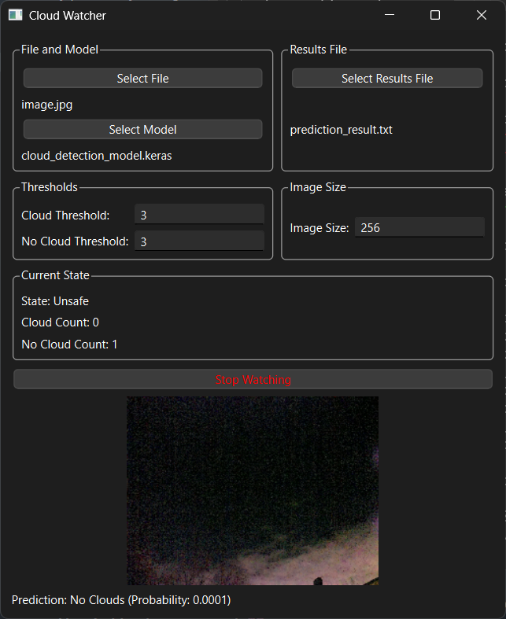

# Cloud Detection Project

This project uses a Convolutional Neural Network (CNN) to detect the presence of clouds in images. It provides scripts for training the model, making predictions on single images, and monitoring a directory for new images.



## Project Structure

```
cloud-detection/
├── cloud_model.py         # Defines the CNN model architecture.
├── cloud_functions.py     # Contains core functions for data handling, model training, and prediction.
├── cloud_detector.py      # Main script for training and single image prediction.
└── cloud_watcher.py       # Script for monitoring a directory and making predictions.
└── requirements.txt       # Lists project dependencies when using only commandline.
└── cloud_watcher_gui.py   # Clout Watcher GUI with PyQT6
└── cloud_training_gui.py  # Clout Training GUI with PyQT6
└── requirements_gui.txt   # Lists project dependencies when using the GUI.

```

## Requirements

*   Python 3.7+
*   TensorFlow 2.x
*   Keras
*   scikit-learn
*   astropy
*   NumPy <2.0
*   opencv-python

## Requirements GUI
*   PyQT6
*   PyQTGraph


## Install dependencies:

**To install the packages, navigate to the project's root directory in your terminal or command prompt and run the following command:**

```bash
pip install -r requirements.txt
```

or for using the GUI

```bash
pip install -r requirements_gui.txt
```

## Usage
1. Clone this repo.
2. Sort your images for training into the 2 folders named clouds and no-clouds
3. Train the model:
```bash
python cloud_detector.py --train
```
4. Verify the model:
```bash
python cloud_detector.py --image path/to/image.jpg
```
5. Watch a file and continuously predict on change:
```bash
python cloud_watcher.py --file path/to/watch_file
```
6. Optional: This will launch the Cloud Watcher GUI application.
```bash
python cloud_watcher_gui.py
```

## Watcher GUI Instructions

Main Window:

* Image View: Displays the loaded image.
* Start/Stop Button: Starts or stops the prediction loop.
* State Label: Shows the current state (Clouds or No Clouds).
* Cloud Count: Counts the number of consecutive "Clouds" predictions.
* No Cloud Count: Counts the number of consecutive "No Clouds" predictions.
* Results File: Select a file to save prediction results.

Using the GUI:

1. Click the "Select Image" button and choose an image file.
2. Optionally, select a results file (.txt) to save prediction results.
3. Click the "Start Watching" button to begin processing the image in a loop.
4. The application will display the predicted state (Clouds or No Clouds) in the "State Label".
5. Consecutive cloud and no-cloud predictions are counted and displayed.
6. To stop processing, click the "Stop Watching" button.

### Configuration (Optional)

The application can optionally save and load settings related to file paths and prediction thresholds.

## Cloud Detection Model

### Training a Model

**Gather training data:**
* Prepare a dataset of images containing clouds and clear skies.
* Ensure images have consistent dimensions (e.g., 800x600 pixels).
* Organize images into subfolders named "clouds" and "no-clouds".

There are two ways to train a model: using the command line or using the graphical user interface (GUI).

**1. Command-Line Training: (Recommended)**

```bash
python cloud_detector.py --train --data_dir path/to/data --image_size 256 --batch_size 32 --epochs 30 --model_output cloud_model
```

*   `--data_dir`: Path to training data (organized in `clouds` and `no-clouds` subdirectories).

Optional:

*   `--image_size`: Image size after resize (e.g., 256x256).
*   `--batch_size`: Training batch size.
*   `--epochs`: Number of training epochs.
*   `--model_output`: Output path for the trained model (without extension).

**2. GUI Training: (Experimental)**

```bash
python cloud_training_gui.py
```
**Use the Training GUI:**
* **Data Path:** Click "Select Data Path" and choose the directory containing your "clouds" and "no-clouds" subfolders.
* **Training Parameters:** Enter the desired number of epochs, batch size, and learning rate in the respective input fields.
* **Start Training:** Click "Start Training" to begin the training process. The GUI will display real-time plots of training loss, validation loss, and training accuracy.
* **Stop Training:** Click "Stop Training" to interrupt the training process if needed.
* **Model Output:** The trained model will be saved to the specified output path.

**Note:** Training time depends on the size and complexity of your dataset and available computational resources.

### Predicting on a Single Image

```bash
python cloud_detector.py --model path/to/cloud_model.keras --image path/to/image.jpg --image_size 256
```

*   `--model`: Path to the trained model (`.keras` file).
*   `--image`: Path to the image for prediction.
*   `--image_size`: Image size used during training.

### Monitoring a Directory using commandline

```bash
python cloud_watcher.py --file path/to/watch_file --model path/to/cloud_model.keras --output predictions.txt --image_size 256
```

*   `--file`: File to watch for changes (touch this file to trigger prediction).

Optional:

*   `--model`: Path to the trained model.
*   `--output`: Output file for predictions.
*   `--image_size`: Image size used during training.

## Data Format

Training data should be in a directory with two subdirectories:

*   `clouds`: Contains images with clouds.
*   `no-clouds`: Contains images without clouds.

Supported image formats: `.png`, `.jpg`, `.jpeg`, `.fits`.

## FITS Image Handling

The code includes normalization for FITS images based on their data type.


## Logging

`cloud_watcher.py` logs events to `watcher.log`.

## Model Architecture

The CNN architecture (defined in `cloud_model.py`) is a simple convolutional stack followed by dense layers.

## Contributing

Contributions are welcome.